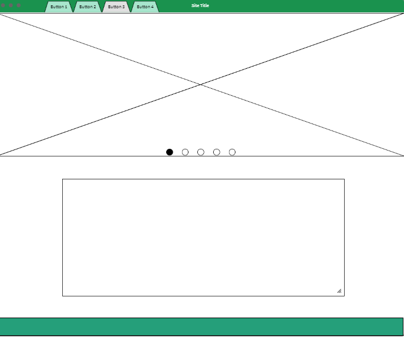
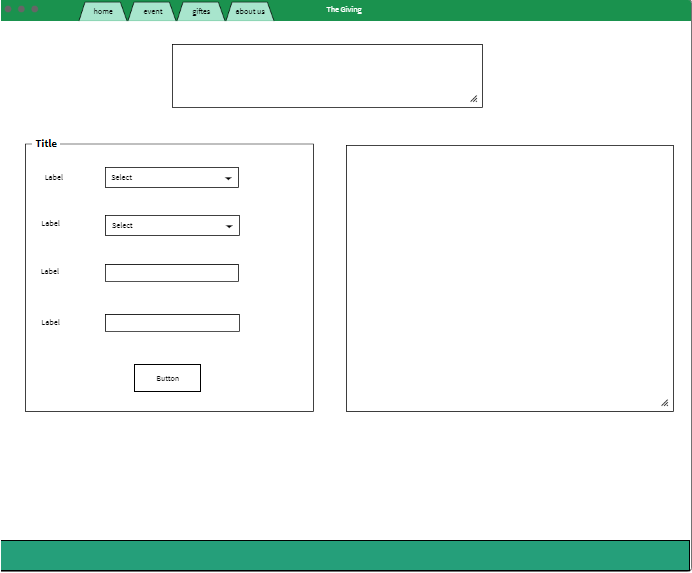
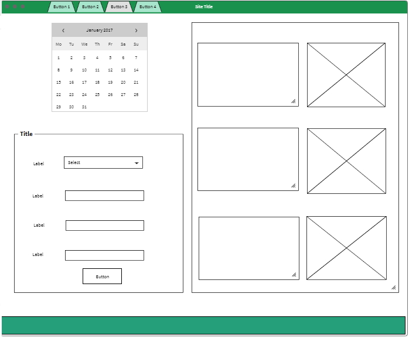

# The Giving 

## Super-devs5 Names:

1. Noor AL-Shareedeh(AL-Omari).
2. Judy AL-Taweel.
3. Eid Sukariah.
4. Mahmoud AL-Zoubi.
5. Omar AL-Zoubi.

## Description of the project:

A charity web site that care about the affairs of the needy and helps them with in-kind and Financial, by organizing volunteer events and collecting donations. Contains four pages :

1. Home page : Descript the web site idea.
2. Collecting gifts : Contain form to specify type of gifts (in-kind and Financial) and for any category.  
3. Volunteer events : Provide event details, dates and a volunteer application form.
4. About Us : Our names and contact details. 

### Wireframe:
1. Home 

2. Gift

3. Event

## User Stories:

The user can choose if he want to volunteer or to donate. So he will find a form for donation that he can select the category and the type of donation (gift). If he choose in-kind will show him a form to indecate the gift and the quantity in addition to his contact information. After submition he will have a thanks message contain his name and the category he selected and the gift he donated. 
If he choose financial will show him a form to indecate the amount and the card number in addition to his contact information. After submition he will have a thanks message contain his name and the category he selected and the amount he donated. 
If the user want to volunteer in our events he can fill the form by his information and select the event he prefer to volunteer in it. After submition he will have a thanks message contain his name and the event he selected.
In the home page the user can know about our charity site. Also, he can know who create this web site in about us page.

